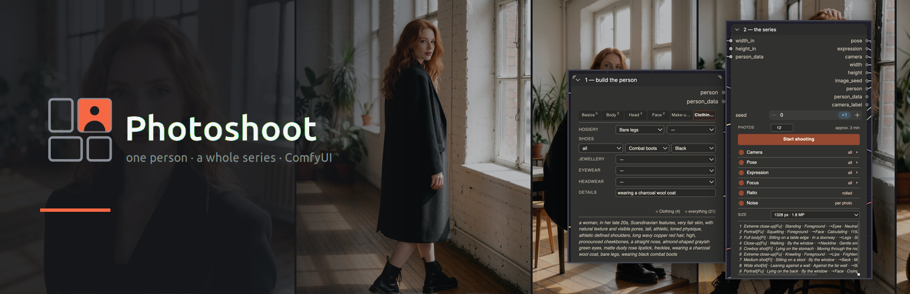
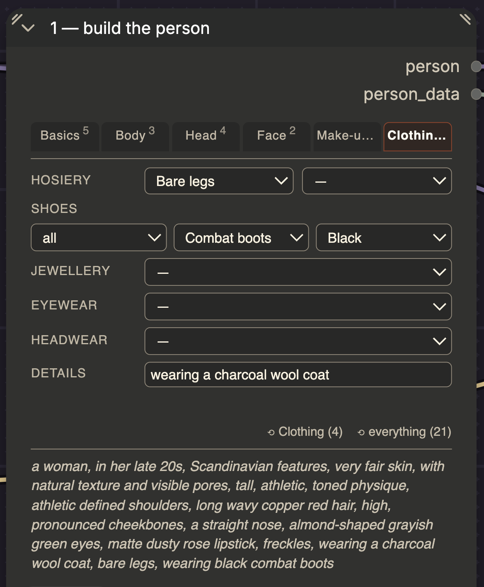
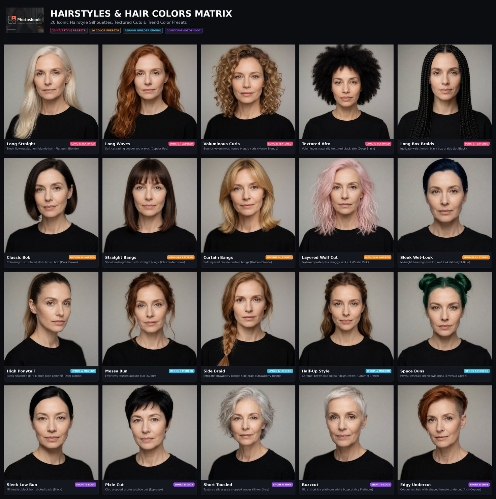
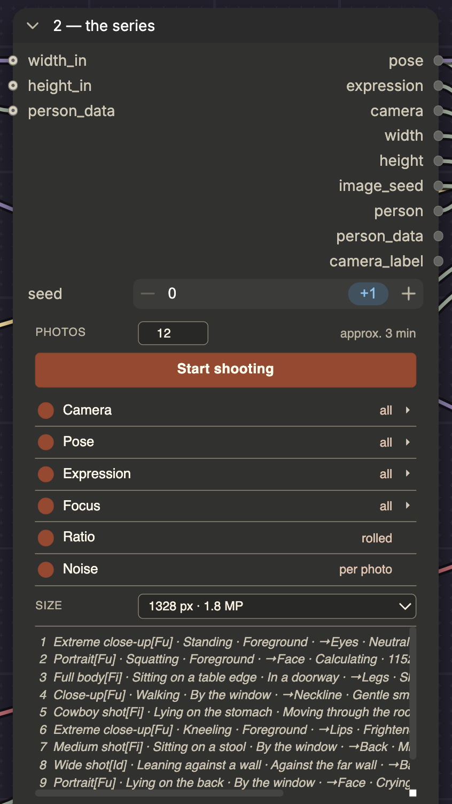

# Photoshoot

[](https://github.com/ralksta/ComfyUI-Photoshoot/releases)
[](CHANGELOG.md)
[](docs/GUIDE.md)
[](docs/POSTERS.md)



> [!IMPORTANT]
> **Top 5 Changes in Release 2.2.0:**
> 1. **Lighting Studio Engine:** New standalone `Photoshoot Lighting` node with 30 studio, natural daylight, and creative atmospheric setups ([View Lighting Matrix](docs/POSTERS.md#lighting--atmosphere-studio-matrix-30-setups)).
> 2. **FACS Action Units for Expressions:** Concrete physical muscle triggers (open-mouth laughs, bared teeth, panic eyes, crying tears) eliminating resting-face bias ([View Expressions Matrix](docs/POSTERS.md#expressions--emotion-spectrum-12-facial-moods)).
> 3. **66-Model Footwear Engine:** Expanded to 66 photorealistic shoe models across 8 categories with macro detail isolation ([View Footwear Matrix](docs/POSTERS.md#footwear--shoe-matrix-66-models)).
> 4. **How-To & Prompt Engineering Guide:** Comprehensive empirical guide on token priorities, FACS Action Units, and the "Less is More" 3–5 anchor rule ([Read Guide](docs/GUIDE.md)).
> 5. **Inspire Me Generator & Clean Layouts:** 1-click coherent character archetypes in Person Builder and non-overlapping example workflow templates.
> 
> [**Read full changelog →**](CHANGELOG.md)

**You built a person. Now shoot 40 photos of her.**

Photoshoot is a set of ComfyUI nodes in two halves. The **Person Builder** describes
someone across 44 fields — body, face, hair, make-up, clothing — and saves them
under a name. The **Photoshoot** turns that person into a whole series: every
photo a different framing, pose, placement, expression and aspect ratio, while
the person stays the same. Set the count, press the button, and the node queues
all 40 runs itself.


## Building a person

44 fields across six tabs. You pick labels; the node writes English. Related fields
share a row — hair and its colour, eye shape and eye colour, lips and finish —
because they are merged into one phrase and you need to see both while setting
either.

A person with nineteen fields set:

```text
Basics    Woman · Late 20s · Scandinavian · Very fair · Natural pores
Body      Tall · Athletic · Athletic shoulders
Head      Long waves + Copper red · Almond-shaped + Greyish green
Face      High, pronounced cheekbones · Straight nose
Make-up   Dusty rose + Matte · Freckles
Clothing  Bare legs · Combat boots + Black
Details   wearing a charcoal wool coat
```

That produces one string, and the eye shape and colour have become a single
phrase rather than two competing ones:

```text
a woman, in her late 20s, Scandinavian features, very fair skin, with natural
texture and visible pores, tall, athletic, toned physique, athletic defined
shoulders, long wavy copper red hair, high, pronounced cheekbones, a straight
nose, almond-shaped grayish green eyes, matte dusty rose lipstick, freckles,
wearing a charcoal wool coat, bare legs, wearing black combat boots
```

The same person seen from further away — this is what the Photoshoot sends for a
full-body shot, and for a wide one:

```text
[figure]    … long wavy copper red hair, almond-shaped grayish green eyes,
            freckles, wearing a charcoal wool coat, bare legs, black combat boots
            (cheekbones, nose and lipstick dropped — 303 chars instead of 376)

[identity]  … long wavy copper red hair, grayish green eyes, freckles,
            wearing a charcoal wool coat, bare legs, black combat boots
            (eye shape and shoulders dropped too — 261 chars)
```

Nothing is lost: the builder keeps all nineteen fields and still shows them. Only
what gets sent shrinks with distance, because tokens the camera cannot resolve
still pull the composition onto the head.



*The Person Builder, Clothing tab. The superscripts count what is set on each
tab; hosiery and shoes carry their colour as a separate field on the same row;
the reset buttons name what they would clear. The composed English sentence sits
at the bottom and updates as you click.*

<details>
<summary><b>View Visual Footwear & Shoe Matrix (66 Models Poster)</b></summary>
<br>

[](docs/POSTERS.md)

*Click image or visit the **[Visual Reference Posters Catalogue](docs/POSTERS.md)** for full-resolution sheets & all categories.*

> [!NOTE]
> *ComfyUI-Photoshoot builds precision prompt tokens and framing instructions. Visual output depends on your diffusion model and checkpoint (rendered above with Krea2 Turbo fp8 + Qwen-VL, 8 steps, 0 LoRAs).*

<br>
</details>

<details>
<summary><b>View Visual Lighting & Atmosphere Matrix (30 Setups Poster)</b></summary>
<br>

[](docs/POSTERS.md)

*Click image or visit the **[Visual Reference Posters Catalogue](docs/POSTERS.md)** for full-resolution sheets & all categories.*

<br>
</details>

<details>
<summary><b>View Visual Hairstyles & Hair Colors Matrix (20 Presets Poster)</b></summary>
<br>

[](docs/POSTERS.md)

*Click image or visit the **[Visual Reference Posters Catalogue](docs/POSTERS.md)** for full-resolution sheets & all categories.*

<br>
</details>

<details>
<summary><b>View Visual Poses & Postures Reference Guide (18 Postures Poster)</b></summary>
<br>

[](docs/POSTERS.md)

*Click image or visit the **[Visual Reference Posters Catalogue](docs/POSTERS.md)** for full-resolution sheets & all categories.*

<br>
</details>

<details>
<summary><b> View Visual Expressions & Emotion Spectrum (12 Moods Poster)</b></summary>
<br>

[](docs/POSTERS.md)

*Click image or visit the **[Visual Reference Posters Catalogue](docs/POSTERS.md)** for full-resolution sheets & all categories.*

<br>
</details>

## The photoshoot

Six axes. Each can be switched off — then it holds still — or restricted to a
family: *only standing poses*, *only calm moods*, *only close-ups*.

| Axis | What varies |
|---|---|
| **Camera** | 7 framings, extreme close-up through wide shot |
| **Pose** | 18 postures in 4 families, plus placement in the room, orientation, arms, legs, tension — placement is coupled to the framing and tension to the posture, so no photo asks for a figure that is leaning against a wall and curled up at once |
| **Expression** | 90 moods in 9 families, plus eyes, gaze, mouth, brows, head tilt |
| **Focus** | 12 focal points, face to feet — coupled to the framing, since a wide shot does not focus on the lips |
| **Ratio** | 9 aspect ratios at a constant pixel count, coupled to the framing so a full-body shot never lands in 16:9 landscape |
| **Noise** | a fresh seed per photo, or one seed for the whole series to keep the setting recognisable |



Two things make this a series rather than 40 random images.

**It counts, it does not roll dice.** Run 7 always produces the same photo, so a
series is reproducible and you can extend it later. Counting uses a Kronecker
sequence — each field steps by the fractional part of a different square root —
because plain integer factors made fields with related list lengths march in
lockstep: the same body turn kept arriving with the same mouth.

**The person shrinks with distance.** The prompt for a wide shot drops lipstick,
eyeliner and brow shape and keeps the silhouette. Those tokens are invisible at
that range but still pull the composition back onto the head.
[More on that](docs/nodes.md#framing-wins-over-description).

## What a series looks like


Eight runs of one series, unretouched. Same person throughout — the hair, the
freckles, the charcoal coat and the black boots come from the Person Builder and
do not drift. What changes is the framing, the pose, where she stands in the
room, the expression and the aspect ratio; the two wide shots are landscape
because the framing chose the ratio.

You set the count — the default is twelve, 40 is as easy. The person is fixed;
everything else moves. This is the node's own preview of the first eight runs:

```text
 1  Extreme close-up → Eyes      Standing                Foreground              Neutral      1328×1328 [full]
 2  Portrait         → Face      Squatting               Foreground              Calculating  1152×1536 [full]
 3  Full body        → Legs      Sitting on a table edge In a doorway            Skeptical     992×1776 [figure]
 4  Close-up         → Neckline  Walking                 By the window           Gentle smile 1184×1488 [full]
 5  Cowboy shot      → Waist     Lying on the stomach    Moving through the room Defiant      1088×1632 [figure]
 6  Extreme close-up → Lips      Kneeling                Foreground              Frightened   1328×1328 [full]
 7  Medium shot      → Back      Sitting on a stool      By the window           Mischievous  1088×1632 [figure]
 8  Wide shot        → Back      Leaning against a wall  Against the far wall    Seductive    1328×1328 [identity]
```

Every run is a plain prompt. Photo 1 comes out as:

```text
extreme close-up shot, with the focus on the eyes, a sunlit loft with tall
windows, a woman, in her late 20s, Eastern European features, fair skin, tall,
hourglass figure, long wavy dark brown hair, almond-shaped green eyes, matte red
lipstick, wearing black opaque pantyhose, wearing black stiletto high heels,
standing, placed in the foreground, facing the camera directly, both arms held
behind the back, hands clasped together, legs closed together, with an upright
posture, a neutral expression, wide open eyes, looking directly at the camera,
relaxed brows, lips closed, head held straight, editorial photography, 85mm
```

The `[full]` / `[figure]` / `[identity]` tag is that detail level — compare
photo 1 with photo 8 and the lipstick is gone.

## Wiring

```text
Person Builder ──person_data──► Photoshoot ──┬── person   ─┐
  44 fields, saved once          the series  ├── pose      │
                                             ├── expression├──► Build Prompt ──► your sampler
                                             ├── camera    │
Scene / Style ───────────────────────────────┴── width/height/seed
```

1. **Build a person.** 44 fields across six tabs. Save under a name and reuse
   across sessions — the point is that the same person comes back.
2. **Send them to a photoshoot.** Set the count, restrict the axes you care
   about, then press **Start shooting** in the node's own panel — that button,
   not the Queue button above the canvas. Queue renders one run, photo 1 of the
   series; *Start shooting* resets the counter and queues the whole series.
3. **Assemble the prompt.** Placeholders (`{camera}`, `{person}`, `{pose}` …)
   drop the parts into your own text, or the node appends them in a sensible
   order if you have none.

Pose and expression also work as standalone nodes when you do not want a series.

### Already have your character?

Then leave step 1 out. The Person Builder is optional — unwire it and the
`{person}` placeholder simply drops from the prompt, no stray commas, and the
Photoshoot node varies framing, pose, placement, expression and aspect ratio
around whoever your character already is:

```text
close-up shot, with the focus on the neckline, walking, near a window, torso
turned away, looking back over the shoulder, arms wrapped around the knees,
knees together, feet apart, back arched, a soft gentle smile, eyes closed,
looking past the camera, furrowed brows, pursed lips, head tilted slightly
```

That is a whole series' worth of direction with no description of a person in
it. Whatever holds your character — a LoRA and its trigger word, an IPAdapter
reference, an identity-preserving edit model — supplies the who, and these
nodes supply everything else. Put the trigger word in the `{extra}` placeholder
if you need it first in the prompt.

Two things help there. Describing the face on top of a reference or a LoRA
gives the model two sources for one thing, so leave those fields empty. And a
reference photo shows no body below the shoulders, so the body tab is worth
filling in even when the face comes from elsewhere — otherwise every image
invents a different build.

You do need one of those mechanisms, though. Plain img2img is not a substitute:
the latent carries the source image's geometry, so framing and aspect ratio
cannot move, and with the description gone nothing holds the identity either.
[Measured](docs/measurements.md) at three denoise levels — at 0.45 the framing
never changed and the face already had, at 0.85 the direction won and the person
was someone else.

### Need a character to use elsewhere?

The other direction: a handful of consistent images of one person, to feed a
reference input, a LoRA training set, or the next shot of a video.

**Switch the noise axis off before you go looking**, not after. This is the one
place where the obvious order is the wrong one. With noise on, every run
reinvents everything the description leaves open, so no two runs share a face.
Switching the axis off replaces that with a single series seed and puts a seed
field with a die next to it — roll it until you like who turns up, and from then
on she is fixed. Camera, pose and expression keep varying, because those come
from the prompt rather than from the noise.

Doing it the other way round is the trap: find someone you like at run 7,
switch the axis off, and you get a stranger, because the seed changed from
`7 × 2654435761 mod 2³¹` to whatever the series seed says. If you do want to
keep a particular run, that formula is the answer — run 7 is seed
`1401181143`, typed into the field.

Then restrict the camera axis to the framings you need, set the count, and
press **Start shooting**. Which framings depends on what has to stay fixed: a
close-up carries the face and nothing below the shoulders, a full-body shot
carries the clothes and the build but no facial detail. Keep both and pick per
use.

A character LoRA fits in here too, if you have one. The workflow below already
carries the loader, wired between the `UNETLoader` and both samplers and shipped
**bypassed**, so it runs untouched as it is: pick your file, press `Ctrl+B`, and
the model flows through it instead of around it. You do not need one, though.
The noise seed alone holds a person still.

[`example_workflows/photoshoot-anchor-set.json`](example_workflows/photoshoot-anchor-set.json)
is all of that already set up: same graph as the series workflow, but with the
noise axis off and a seed in place, the ratio fixed, the mood held to one
family and the count at six. Load it, press **Start shooting**, and you have
your anchor set — without having to know about the trap above first. Images go
to `photoshoot/anchor` so they do not mix with a series.

## Example workflow

[`example_workflows/photoshoot-series.json`](example_workflows/photoshoot-series.json)
is the whole thing wired up — drag it onto the ComfyUI canvas.

It contains the three Photoshoot nodes above, a scene and a style field, and a
two-pass sampler: 8 steps at full denoise, a 1.5× latent upscale, then 4 steps
at denoise 0.44. Keeping the upscale but dropping the refinement is the one
combination to avoid — that takes 11.4 s instead of 24.8 s and comes out
unusably soft, because latent upscaling invents no detail, it only pulls things
apart. Dropping *both* is a different thing — see "Draft before you shoot"
below.

`width` and `height` come from the Photoshoot node, so the aspect ratio follows
the framing. `bildseed` feeds both samplers, which is what makes a run
reproducible.

### Draft before you shoot

Before shooting a series you usually want to see the first five or six runs:
is the person right, the scene, the style, the axes you restricted? Rendering
those at full quality is a waste, because you are going to change something and
shoot them again.

**Select `LatentUpscaleBy` and the second `KSampler`, press `Ctrl+B`.** That is
bypass, not mute: both nodes take a LATENT and hand back a LATENT, so the latent
passes straight through them and the decode reads the first sampler instead of
the second. Measured here against local Krea 2 weights, that is **10.2 s per
image instead of 21.5 s**, at the base resolution rather than 1.5×. Sharp, just
smaller. Press `Ctrl+B` again and you are back at full quality with every
setting untouched — which is the point of doing it this way rather than in a
second file: the person, the scene and the axis restrictions live in the nodes,
and moving them across workflows is work.

Because the series counts through combinations rather than drawing at random,
runs 1 to 6 in the draft are runs 1 to 6 in the finished series. You are
previewing the real thing, not a stand-in. Six calibration images cost 61 s
instead of 129 s, and you rarely go round only once.

If you would rather keep the drafts out of the finished set, change the
`SaveImage` prefix while the two nodes are bypassed.

Drafting a whole series works too, and there it depends on how many you keep,
since everything renders twice: forty full runs cost 860 s, forty drafts plus
*k* re-renders cost 408 + 21.5·*k*, even at **k ≈ 21**.

The three loaders name the files [Comfy-Org publishes for Krea
2](https://huggingface.co/Comfy-Org/Krea-2) — `krea2_turbo_fp8_scaled`,
`qwen3vl_4b_fp8_scaled` as CLIP type `krea2`, and `qwen_image_vae` — so the
example matches what you already have if you followed the official ComfyUI
tutorial. If yours are named differently, ComfyUI flags the loader nodes on load
and you pick your own; the rest of the graph is unaffected.

The text encoder is the one part that is not interchangeable. Krea 2 taps twelve
layers of Qwen3-VL-4B at a hidden size of 2560, so plain Qwen3-4B (no vision
tower) and the 32B build (wrong width) will not load.

After changing anything under `js/`, bump the version in `pyproject.toml` and
run `python3 tools/setze_js_version.py`. ComfyUI serves the `.mjs` files without
a Cache-Control header, so without a fresh `?v=` in the import a browser can sit
on the old interface for a day or more.

The workflow is generated by `tools/baue_workflow.py`, which checks every node
type, input name, output index and required input against a running ComfyUI. It
was verified by actually executing it, not just by loading it.

## Which models does this work with?

Any of them, in principle. The nodes emit **text** — the person, the pose, the
expression, the camera phrasing — plus width, height and a seed. Nothing here
touches a model, so whatever consumes a prompt can consume these.

**Nothing goes in, either.** These nodes take no image and no reference — you
state the person, so nothing is guessed. That is the difference to a workflow
driven by one portrait photo: such a photo holds no body below the shoulders,
so the model fills the gap from its own prior. The two combine well, though.
Since all that leaves here is a string, an IPAdapter can carry the face while
these fields say what the photo cannot show.

What differs is how much of it survives:

- **Models with a T5 or LLM text encoder** — Flux, SD 3.5, Qwen-Image, Krea 2 —
  are the good case. A finished prompt here runs 760 to 1000 characters, median
  around 840, roughly 190–250 tokens, and these read all of it as connected
  language. The whole design assumes this: that "arms behind the back, hands
  clasped together" lands as a sentence rather than as loose keywords.
- **CLIP-only models** — SD 1.5, SDXL — cap out at 77 tokens per chunk. The
  prompt still works, but it gets split, and details near the end lose weight.
  Set fewer fields, and use the detail levels: a wide shot already sends a much
  shorter person block.
- **Edge lengths** run 1024 to 1536, sized for current models. For SD 1.5 at
  512 they are too large; the ratio coupling still helps, the pixel counts do
  not.

Krea 2 is what the [measurements](docs/measurements.md) were taken against and
what the example workflow loads — that is the extent of the tie.

## Installation

No dependencies beyond ComfyUI itself.

Through **ComfyUI Manager**: search for *Photoshoot* and install. Or by hand:

```bash
cd ComfyUI/custom_nodes
git clone https://github.com/ralksta/ComfyUI-Photoshoot
```

Restart ComfyUI afterwards; the nodes appear under the **Photoshoot** category.

What changed between versions is in the [changelog](CHANGELOG.md), and every
version is tagged as a [release](https://github.com/ralksta/ComfyUI-Photoshoot/releases)
— watch the repository for releases only if you want to hear about new ones.

The interface follows ComfyUI's language setting: German if ComfyUI is set to
German, English otherwise. Note that ComfyUI defaults to your **browser
language** when you have never picked one, so a German browser gives you a
German interface without you setting anything. Pick a language explicitly under
Settings → Comfy → Locale. The prompt is identical either way — see
[Language](docs/internals.md#language).

## The nodes

| Node | What it does |
|---|---|
| **Photoshoot Person** | 44 fields on six tabs; outputs the person as text and as JSON |
| **Photoshoot Series** | the series: six axes, queues the runs itself |
| **Photoshoot Pose** | posture, placement, orientation, arms, legs, tension |
| **Photoshoot Expression** | 90 moods in nine families, plus eyes, gaze, mouth, brows, head |
| **Photoshoot Build Prompt** | drops the parts into your prompt text |
| **Save / Load** | persons, scenes, styles and prompts under `ComfyUI/user/krea2_*` |
| **Photoshoot Pick Blocks** | four dropdowns, four outputs in one node |

[**Full reference →**](docs/nodes.md) — every control, and why the awkward ones
are the way they are: how focus is coupled to framing, why the person block
shrinks with distance, how the series counts without repeating itself.

## More

- [**How-To & Prompt Engineering Guide**](docs/GUIDE.md) — empirical learnings, FACS Action Units, token order, avoiding neutralizers, and turbo vs standard models
- [Internals](docs/internals.md) — layout, translation, tests, which ComfyUI
  versions this was built against
- [Measurements](docs/measurements.md) — what actually got measured, including
  a conclusion that turned out to be wrong
- [Changelog](CHANGELOG.md)

## Saved blocks

The stores live under `ComfyUI/user/krea2_*` and are **not** part of this
repository — that is where personal content ends up. If you want them backed up,
copy those folders deliberately.

## Scope

Photoshoot describes adult subjects. The age presets start at the early 20s,
and the exact-age field has a floor of 18 — type a lower number and both the
preview and the prompt say 18.

That floor is a guardrail against the accident, not a content filter. These
nodes only emit text, and text can be typed into any node.

## License

MIT — see [LICENSE](LICENSE).
